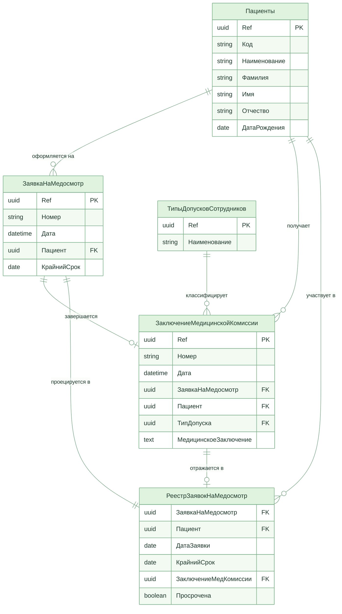

# ER-диаграмма Медосмотры

```mermaid
%%{init: {
  "theme": "base",
  "themeVariables": {
    "background": "#f6fbf4",
    "primaryColor": "#dff3df",
    "primaryTextColor": "#1f3b2d",
    "primaryBorderColor": "#7fb38c",
    "lineColor": "#6c9f7a",
    "secondaryColor": "#eef8ea",
    "tertiaryColor": "#f8fcf6",
    "fontFamily": "Arial"
  }
}}%%
erDiagram
    Пациенты {
        uuid Ref PK
        string Код
        string Наименование
        string Фамилия
        string Имя
        string Отчество
        date ДатаРождения
    }

    ЗаявкаНаМедосмотр {
        uuid Ref PK
        string Номер
        datetime Дата
        uuid Пациент FK
        date КрайнийСрок
    }

    ЗаключениеМедицинскойКомиссии {
        uuid Ref PK
        string Номер
        datetime Дата
        uuid ЗаявкаНаМедосмотр FK
        uuid Пациент FK
        uuid ТипДопуска FK
        text МедицинскоеЗаключение
    }

    ТипыДопусковСотрудников {
        uuid Ref PK
        string Наименование
    }

    РеестрЗаявокНаМедосмотр {
        uuid ЗаявкаНаМедосмотр FK
        uuid Пациент FK
        date ДатаЗаявки
        date КрайнийСрок
        uuid ЗаключениеМедКомиссии FK
        boolean Просрочена
    }

    Пациенты ||--o{ ЗаявкаНаМедосмотр : "оформляется на"
    Пациенты ||--o{ ЗаключениеМедицинскойКомиссии : "получает"
    ЗаявкаНаМедосмотр ||--o| ЗаключениеМедицинскойКомиссии : "завершается"
    ТипыДопусковСотрудников ||--o{ ЗаключениеМедицинскойКомиссии : "классифицирует"
    ЗаявкаНаМедосмотр ||--|| РеестрЗаявокНаМедосмотр : "проецируется в"
    Пациенты ||--o{ РеестрЗаявокНаМедосмотр : "участвует в"
    ЗаключениеМедицинскойКомиссии ||--o| РеестрЗаявокНаМедосмотр : "отражается в"
```
